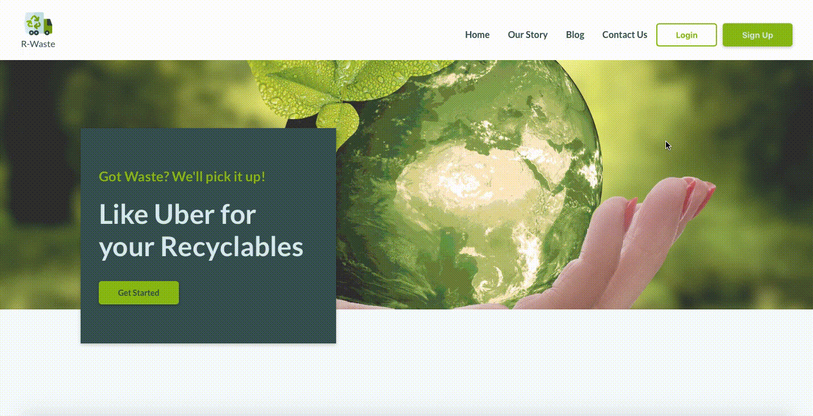
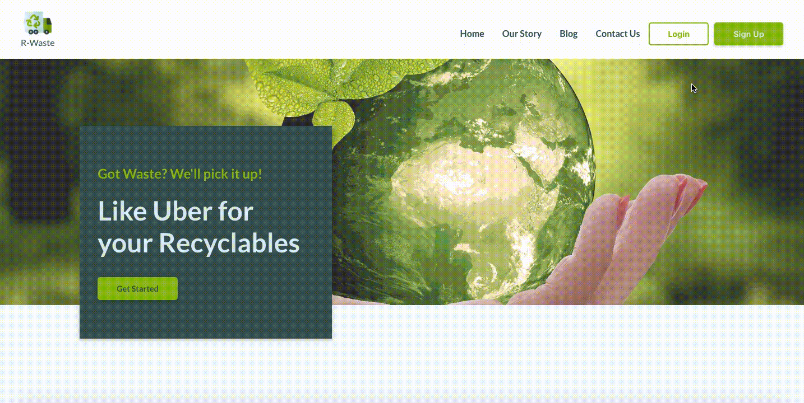
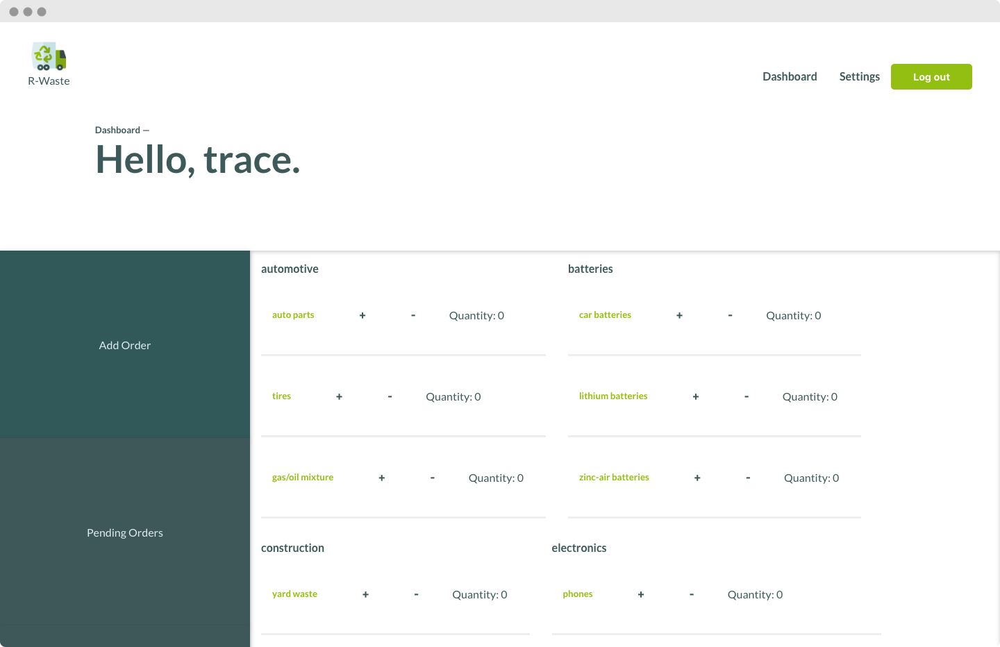

# R-Waste
## Corporate Waste Ticketing and Scheduling Application 





## Overview 
R-Waste was developed and founded in Atlanta, Ga by four young engineers in the south’s largest tech hub, Atlanta Tech Village. The idea started off as a class project but soon became OUR way of saving the earth. Many of us would like to recycle more often but questions like where, what, and how holds us back from doing so.

Have no fear, R-Waste is here! Simply sign up, choose your desired recyclables, pick up time, and there you have it, you just saved the world! All superheroes don’t wear capes but with R-Waste you can save OUR world!


<strong>The goal of this application is to assist waste management companies to provide quick quotes and schedule waste pick up for consumers - think Uber but for waste removal.</strong>

### Ticket Lifecycle 
 1. Consumer submits a ticket with their waste removal requirements
 2. The Company updates the tickets with a quote and final scheduling requirements
 3. Consumer users have the option to either accept or deny the the quote
 4a. If the quote is accepted, the ticket is placed in a scheduled queue for both consumer and end user
 4b. If the quote is declined, the ticket is removed from queue

### Next Step: 
During this two week sprint, we couldn't pack all the features we wanted to include.  Some of the next steps for this app include: 
1. UI/UX Enhancement such as, status bar animation, for both consumer and company dashboards
2. Email notifications 
3. Mobile Application
4. Create auction feature so multiple companies can bid on recycling jobs 

## Installation Instructions 
Step 1: Clone repo
Step 2: From the directory you just cloned, install dependencies:  
```javascript
npm install
```
Step 3:  Create a ".env" file:  
File defaults are the following:
```
DB_HOST=localhost  
DB_PORT=5432
DB_NAME=my-recycler
```
Step 4: Install postgres if not already installed . 
```
https://www.postgresql.org/download/
```
Step 4a: To build the required tables:  
```
npm run db:reset
```
Step 5: Browse to http://localhost:3100 

Step 6: To make changes to the front-end REACT App 
'''
git clone https://github.com/360klacy/my-recycler-front-end.git
'''

## Technologies Utilized 
* Node.js 
* Socket.io
* Postgres Database 
* Express.js
* React.js
* JavaScript 
* CSS
* HTML 


-crop.png)

-crop.png)


